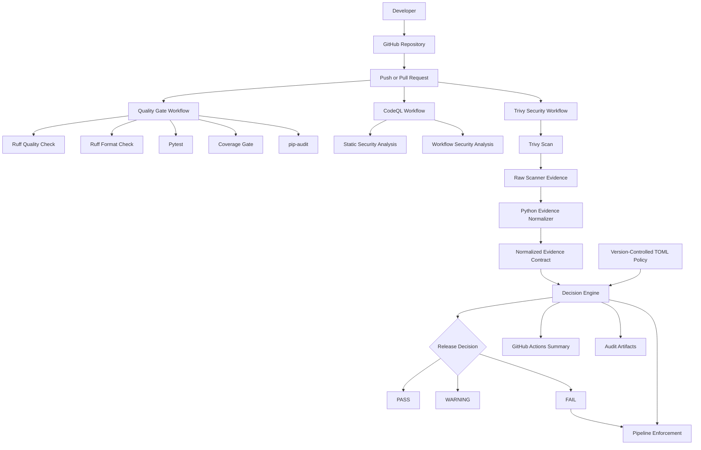

# Automated Release Governance POC

[](https://github.com/shry-mv/automated-release-governance-poc/actions/workflows/quality-gate.yml)
[](https://github.com/shry-mv/automated-release-governance-poc/actions/workflows/codeql.yml)
[](https://github.com/shry-mv/automated-release-governance-poc/actions/workflows/trivy-security.yml)

A portfolio reference implementation of an automated, policy-driven and auditable software release governance pipeline built with Python and GitHub Actions.

The project demonstrates how distributed quality and security controls can be converted into normalized evidence, evaluated against a version-controlled release policy and translated into a single enforceable release decision.

## Executive Summary

Modern delivery pipelines commonly execute testing, code-quality analysis, dependency scanning and security analysis as independent controls.

Although each tool produces useful technical results, organizations still need to answer a broader governance question:

> Is this release candidate compliant with the minimum quality and security requirements required to continue through the delivery process?

This project implements an automated release-governance architecture that:

1. Executes quality and security controls.
2. Preserves scanner-native evidence.
3. Converts tool-specific results into a normalized evidence contract.
4. Evaluates the evidence against a version-controlled policy.
5. Produces an explainable `PASS`, `WARNING` or `FAIL` decision.
6. Blocks the workflow when mandatory controls are not satisfied.
7. Preserves the evidence and final decision as downloadable audit artifacts.

The implementation intentionally separates scanner execution from the final governance decision.

Scanners identify technical findings. The governance layer determines whether those findings satisfy the release policy.

## Current Status

**Portfolio-ready version: `v1.0.0`**

The current implementation provides an end-to-end evidence-driven release-governance flow:

```text
Push or Pull Request
        ↓
Quality and security controls
        ↓
Scanner-native evidence
        ↓
Evidence normalization
        ↓
Version-controlled release policy
        ↓
Governance decision engine
        ↓
PASS / WARNING / FAIL
        ↓
GitHub Summary + audit artifacts + enforcement
```

## Implemented Capabilities

### Automated quality controls

- Python unit testing with `pytest`.
- Test coverage measurement with `pytest-cov`.
- Enforced minimum coverage threshold of 80%.
- Static code-quality validation with Ruff.
- Automated source-format validation with Ruff.
- Python dependency vulnerability auditing with `pip-audit`.

### Automated security controls

- CodeQL static application security testing.
- CodeQL analysis of GitHub Actions workflows.
- Trivy repository scanning.
- Dependency vulnerability detection.
- Secret scanning.
- Misconfiguration scanning.
- Machine-readable JSON security reports.

### Governance capabilities

- Scanner-native raw evidence preservation.
- Python-based evidence normalization.
- Vendor-neutral normalized evidence contract.
- Validation of mandatory audit metadata.
- Fail-closed handling of invalid evidence.
- Version-controlled release policy using TOML.
- Policy-driven release decision engine.
- Explainable control identifiers and findings.
- `PASS`, `WARNING` and `FAIL` decisions.
- Automatic pipeline enforcement.
- GitHub Actions job summary.
- Downloadable evidence artifacts.

## Solution Architecture



## Architectural Layers

### 1. CI/CD orchestration

GitHub Actions coordinates quality validation, security scanning, evidence generation, policy evaluation and enforcement.

The workflows are triggered by:

- Pushes to the `main` branch.
- Pull requests targeting `main`.
- Manual execution through `workflow_dispatch`.

### 2. Technical controls

| Control | Technology | Purpose |
|---|---|---|
| Code quality | Ruff | Detect code-quality and maintainability issues |
| Formatting | Ruff | Enforce consistent source formatting |
| Unit testing | pytest | Validate functional behavior |
| Coverage | pytest-cov | Enforce a minimum test-coverage threshold |
| Dependency security | pip-audit | Detect known vulnerable Python dependencies |
| Static security analysis | CodeQL | Analyze Python source code |
| Workflow security | CodeQL | Analyze GitHub Actions definitions |
| Repository security | Trivy | Detect vulnerabilities, secrets and misconfigurations |

### 3. Evidence normalization

Trivy produces a detailed scanner-specific JSON report.

The Python normalizer converts that report into a smaller and more stable evidence contract containing:

- Scanner name and version.
- Report identifier.
- Execution timestamp.
- Artifact identity.
- Repository, branch and commit.
- Evidence-validity status.
- Missing mandatory metadata.
- Vulnerability totals by severity.
- Report state.

This design reduces direct coupling between the decision engine and Trivy's native schema.

### 4. Policy as configuration

Release requirements are maintained in:

```text
policies/release-policy.toml
```

The current policy defines:

- Scanner evidence must be valid.
- Critical vulnerabilities are not allowed.
- High vulnerabilities are not allowed.
- Medium vulnerabilities generate a warning.
- Invalid or incomplete evidence must fail closed.

The policy can be changed independently from workflow orchestration and decision-engine implementation.

### 5. Governance decision engine

The Python decision engine consumes:

```text
Normalized security evidence
        +
Version-controlled release policy
```

It produces:

```text
release-decision.json
```

Every policy violation includes:

- A control identifier.
- A human-readable message.
- The observed value.
- The expected policy threshold.

### 6. Enforcement

The final workflow step reads the generated decision.

```text
PASS     → workflow continues
WARNING  → workflow continues with observations
FAIL     → workflow is blocked
```

If the decision file is missing or cannot be generated, the workflow also fails.

This implements fail-closed behavior: missing mandatory governance evidence is never interpreted as a successful result.

## Current Decision Model

| Decision | Meaning | Pipeline behavior |
|---|---|---|
| `PASS` | All mandatory controls are satisfied | Continues |
| `WARNING` | Mandatory controls pass, but non-blocking findings require attention | Continues with observations |
| `FAIL` | At least one mandatory control is not satisfied | Blocked |

## Evidence Chain

Each Trivy workflow execution produces three evidence levels:

```text
trivy-results.json
        ↓
Scanner-native raw evidence

trivy-summary.json
        ↓
Normalized vendor-neutral evidence

release-decision.json
        ↓
Policy evaluation and final release decision
```

The files are preserved as GitHub Actions artifacts:

| Artifact | Content |
|---|---|
| `trivy-raw-evidence` | Original Trivy JSON report |
| `trivy-normalized-evidence` | Normalized security evidence |
| `release-governance-decision` | Final policy-driven decision |

Artifacts are retained for 30 days in the current POC configuration.

## Example Governance Decision

```json
{
  "policy": {
    "id": "ARG-POL-001",
    "name": "Repository Security Release Policy",
    "version": "1.0.0"
  },
  "scanner": "trivy",
  "decision": "PASS",
  "blocking_findings": [],
  "warnings": []
}
```

A blocking decision can contain findings such as:

```json
{
  "control_id": "ARG-SECURITY-001",
  "message": "Critical vulnerabilities exceed policy.",
  "actual": 1,
  "expected_maximum": 0
}
```

## Why This Architecture Matters

A successful test execution does not automatically mean that a release satisfies every engineering or security requirement.

For example:

- Tests may pass while coverage remains below the required threshold.
- Code may function correctly but contain maintainability issues.
- Dependencies may contain known vulnerabilities.
- Static analysis may identify insecure coding patterns.
- Repository scanning may detect secrets or unsafe configuration.
- Scanners may produce incompatible schemas and severity models.
- A scanner may finish without producing valid audit metadata.

This architecture separates four responsibilities:

```text
Scanner
   ↓
Collect technical findings

Normalizer
   ↓
Create a stable evidence contract

Policy
   ↓
Define organizational requirements

Decision engine
   ↓
Produce the enforceable release outcome
```

## Technology Stack

| Area | Technology | Purpose |
|---|---|---|
| Application and automation | Python 3.13 | Sample application, normalizer and decision engine |
| Unit testing | pytest | Functional validation |
| Test coverage | pytest-cov | Coverage measurement and enforcement |
| Code quality | Ruff | Linting and formatting validation |
| Dependency auditing | pip-audit | Known-vulnerability detection |
| Static security analysis | CodeQL | Source-code and workflow analysis |
| Repository scanning | Trivy | Vulnerability, secret and misconfiguration scanning |
| CI/CD | GitHub Actions | Workflow orchestration and enforcement |
| Release policy | TOML | Version-controlled control thresholds |
| Evidence | JSON | Scanner, normalized and decision records |
| Version control | Git and GitHub | Source control, automation and collaboration |

## Repository Structure

```text
automated-release-governance-poc/
├── .github/
│   └── workflows/
│       ├── codeql.yml
│       ├── quality-gate.yml
│       └── trivy-security.yml
├── docs/
│   ├── architecture.md
│   └── demo-guide.md
├── governance_engine/
│   ├── __init__.py
│   ├── decision_engine.py
│   └── trivy_normalizer.py
├── policies/
│   └── release-policy.toml
├── sample_app/
│   ├── __init__.py
│   └── pricing.py
├── tests/
│   ├── test_decision_engine.py
│   ├── test_pricing.py
│   └── test_trivy_normalizer.py
├── .gitignore
├── pyproject.toml
├── requirements-dev.txt
└── README.md
```

## GitHub Actions Workflows

### Quality Gate

```text
.github/workflows/quality-gate.yml
```

Executes:

1. Dependency installation.
2. Python dependency vulnerability audit.
3. Ruff code-quality validation.
4. Ruff format validation.
5. Unit testing.
6. Minimum coverage enforcement.

### CodeQL

```text
.github/workflows/codeql.yml
```

Executes:

- Python static application security analysis.
- GitHub Actions workflow analysis.
- Publication of alerts in GitHub Code Scanning.

### Trivy Security Scan

```text
.github/workflows/trivy-security.yml
```

Executes:

1. Repository security scan.
2. Raw JSON evidence generation.
3. Evidence normalization.
4. Release-policy evaluation.
5. Governance-decision publication.
6. Artifact upload.
7. Decision enforcement.

## Running the Project Locally

### 1. Clone the repository

```bash
git clone https://github.com/shry-mv/automated-release-governance-poc.git
cd automated-release-governance-poc
```

### 2. Create a virtual environment

```bash
python3 -m venv .venv
source .venv/bin/activate
```

### 3. Install development dependencies

```bash
python -m pip install --upgrade pip
python -m pip install -r requirements-dev.txt
```

### 4. Run the sample application

```bash
python sample_app/pricing.py
```

Expected result:

```text
Order total: $251.00
```

### 5. Run the quality controls

```bash
python -m ruff check .
python -m ruff format --check .
python -m pip_audit
python -m pytest
```

### 6. Normalize a Trivy report

```bash
python -m governance_engine.trivy_normalizer \
  --input evidence/raw/trivy-results.json \
  --output evidence/normalized/trivy-summary.json
```

### 7. Evaluate the release policy

```bash
python -m governance_engine.decision_engine \
  --policy policies/release-policy.toml \
  --evidence evidence/normalized/trivy-summary.json \
  --output evidence/decisions/release-decision.json
```

## Testing Strategy

The automated tests validate:

- Pricing calculation behavior.
- Expected application output.
- Vulnerability counting by severity.
- `PASS`, `WARNING` and `FAIL` normalization behavior.
- Mandatory Trivy audit metadata.
- Valid evidence handling.
- Invalid evidence handling.
- Fail-closed governance behavior.
- Critical-vulnerability policy violations.
- High-vulnerability policy violations.
- Medium-vulnerability warnings.
- Successful policy-compliant decisions.

The project enforces a minimum total test coverage of 80%.

## Design Principles

### Separation of concerns

Scanners collect findings. Normalizers transform evidence. Policies define thresholds. The decision engine produces the release outcome.

### Vendor-neutral governance

The decision engine consumes normalized evidence instead of depending directly on the complete Trivy schema.

### Policy versioning

Governance requirements are maintained independently from application and pipeline code.

### Explainability

Every failed control includes a stable identifier and a human-readable reason.

### Fail-closed enforcement

Invalid, incomplete or missing mandatory evidence cannot generate a successful release decision.

### Auditability

The evidence retains scanner version, report ID, timestamp, artifact identity, repository, branch, commit and policy version.

### Extensibility

Additional security tools can be introduced through new normalizers or adapters without rewriting the core governance model.

### Incremental delivery

The project was implemented in independently testable phases, beginning with basic quality gates and evolving into automated governance enforcement.

## Security and Production Considerations

This repository is a portfolio POC, not a production governance platform.

A production implementation would also require:

- Protected branches.
- Mandatory pull-request reviews.
- Restricted workflow modification.
- Separation between policy authors and application developers.
- Signed evidence.
- Artifact attestations.
- Immutable audit storage.
- Centralized evidence retention.
- Environment approvals.
- Identity-based authorization.
- Secrets management.
- Policy-schema validation.
- Scanner availability controls.
- Monitoring and operational alerting.
- Recovery and exception-management procedures.

## Delivery Roadmap

### Phase 1 — Automated Quality Gate

- [x] Python sample application
- [x] Unit tests
- [x] Coverage reporting
- [x] Minimum coverage enforcement
- [x] Static code-quality checks
- [x] Formatting validation
- [x] GitHub Actions automation

### Phase 2 — Security Controls

- [x] Python dependency vulnerability auditing
- [x] CodeQL static application security testing
- [x] CodeQL GitHub Actions analysis
- [x] Trivy dependency scanning
- [x] Trivy secret scanning
- [x] Trivy misconfiguration scanning
- [x] Machine-readable scanner evidence

### Phase 3 — Governance Decision Engine

- [x] Evidence normalization
- [x] Mandatory metadata validation
- [x] Version-controlled release policy
- [x] Python decision engine
- [x] `PASS`, `WARNING` and `FAIL` decisions
- [x] Fail-closed behavior
- [x] Automatic pipeline enforcement

### Phase 4 — Auditability

- [x] Raw JSON evidence
- [x] Normalized JSON evidence
- [x] Governance-decision evidence
- [x] GitHub Actions summary
- [x] Downloadable artifacts
- [x] Policy and scanner traceability

### Future Enhancements

- [ ] JSON Schema validation for normalized evidence
- [ ] Multiple scanner adapters
- [ ] Open Policy Agent integration
- [ ] Rego policies
- [ ] Software Bill of Materials generation
- [ ] Container-image scanning
- [ ] Evidence-integrity hashes
- [ ] Artifact attestations
- [ ] Time-limited risk exceptions
- [ ] Exception approval metadata
- [ ] `PASS WITH EXCEPTION`
- [ ] Environment-level deployment approvals
- [ ] Centralized evidence retention

## Documentation

- [Solution Architecture](docs/architecture.md)
- [Portfolio Demo Guide](docs/demo-guide.md)

## Skills Demonstrated

This project demonstrates practical experience in:

- Solution architecture.
- DevSecOps governance.
- CI/CD design.
- Automated quality gates.
- Security-control integration.
- Software supply-chain security.
- Evidence normalization.
- Policy-driven automation.
- Fail-closed architecture.
- Release governance.
- Auditability and traceability.
- Python automation.
- GitHub Actions.
- CodeQL.
- Trivy.
- Automated testing.
- Architecture documentation.
- Incremental technical delivery.

## Portfolio Demo Statement

> This project separates technical scanning from governance decisions. Scanner results are preserved as raw evidence, normalized into a vendor-neutral contract and evaluated against a version-controlled release policy. The resulting decision is explainable, auditable and enforceable through the CI/CD pipeline.

## Release

The first portfolio-ready version is published as:

```text
v1.0.0
```

## Independent Implementation

This project is an independent portfolio implementation based exclusively on public software-delivery, DevSecOps and policy-driven governance patterns.

It does not contain proprietary source code, internal documentation, confidential policies, organization-specific control definitions or non-public architecture.