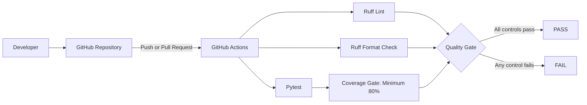

# Automated Release Governance POC

[](https://github.com/shry-mv/automated-release-governance-poc/actions/workflows/quality-gate.yml)

A portfolio reference implementation of an auditable software release governance pipeline built with Python and GitHub Actions.

The project demonstrates how automated quality controls can be integrated into a CI/CD workflow and progressively evolved into a centralized, policy-driven release decision layer.

## Executive Summary

Modern delivery pipelines often execute testing, code quality, dependency security and artifact analysis as isolated controls.

While each tool produces useful technical results, delivery teams still need to answer a higher-level governance question:

> Is this release candidate compliant with the minimum requirements required to continue through the delivery process?

This project explores an architecture in which technical evidence is collected, evaluated and translated into a single, explainable release decision.

The initial implementation focuses on automated code quality and test coverage gates. Future phases will add security scanning, result normalization, policy-as-code evaluation, exception management and auditable evidence bundles.

## Current Capabilities

The current version includes:

- A small Python application used as the analysis target.
- Automated unit testing with `pytest`.
- Test coverage measurement with `pytest-cov`.
- An enforced minimum coverage threshold of 80%.
- Static code quality validation with Ruff.
- Automated formatting validation.
- A GitHub Actions workflow triggered by pushes and pull requests.
- Reproducible development dependencies.
- A clean repository structure prepared for future governance components.

## Current Architecture



## Why This Architecture Matters

A successful test execution does not automatically mean that a release satisfies every engineering requirement.

For example:

- Tests may pass while code coverage remains below the required threshold.
- Code may work but contain quality or maintainability problems.
- Security scanners may detect vulnerabilities after functional validation succeeds.
- Multiple scanners may return results using different formats and severity models.

This POC separates individual technical checks from the final governance decision.

That separation enables future capabilities such as:

- Centralized control definitions.
- Policy versioning.
- Explainable release decisions.
- Temporary and time-limited exceptions.
- Evidence preservation.
- Auditability across pipeline executions.

## Technology Stack

| Area | Technology | Purpose |
|---|---|---|
| Application | Python 3.13 | Sample application and future decision engine |
| Unit testing | pytest | Functional validation |
| Coverage | pytest-cov | Test coverage measurement and enforcement |
| Code quality | Ruff | Linting and formatting validation |
| CI/CD | GitHub Actions | Automated workflow execution |
| Configuration | TOML | Central project and tool configuration |
| Version control | Git and GitHub | Source control and collaboration |

## Repository Structure

```text
automated-release-governance-poc/
├── .github/
│   └── workflows/
│       └── quality-gate.yml
├── governance_engine/
│   └── __init__.py
├── sample_app/
│   ├── __init__.py
│   └── pricing.py
├── tests/
│   └── test_pricing.py
├── .gitignore
├── pyproject.toml
├── requirements-dev.txt
└── README.md
```

## Quality Gate

The current quality gate executes the following controls:

1. Static code quality validation.
2. Code-format validation.
3. Unit-test execution.
4. Minimum test-coverage enforcement.

The workflow fails when any required control does not pass.

This provides an early example of a fail-closed governance model: a release candidate cannot be considered compliant when required evidence is missing or unsuccessful.

## Running the Project Locally

### 1. Clone the repository

```bash
git clone https://github.com/YOUR-GITHUB-USER/automated-release-governance-poc.git
cd automated-release-governance-poc
```

### 2. Create a virtual environment

```bash
python3 -m venv .venv
source .venv/bin/activate
```

### 3. Install development dependencies

```bash
python -m pip install -r requirements-dev.txt
```

### 4. Run the sample application

```bash
python sample_app/pricing.py
```

Expected result:

```text
Order total: $251.00
```

### 5. Run the quality controls

```bash
python -m ruff check .
python -m ruff format --check .
python -m pytest
```

## GitHub Actions

The quality-gate workflow runs automatically when:

- Code is pushed to the `main` branch.
- A pull request targets the `main` branch.
- The workflow is started manually.

The workflow prepares a clean Linux runner, installs Python and the project dependencies, and executes every quality control independently.

This confirms that the project is reproducible outside the developer's local environment.

## Delivery Roadmap

### Phase 1 — Automated Quality Gate

- [x] Python sample application
- [x] Unit tests
- [x] Coverage reporting
- [x] Minimum coverage enforcement
- [x] Static code-quality checks
- [x] Formatting validation
- [x] GitHub Actions workflow

### Phase 2 — Security Controls

- [ ] CodeQL static application security testing
- [ ] Trivy dependency scanning
- [ ] Trivy infrastructure and configuration scanning
- [ ] Machine-readable scanner results

### Phase 3 — Governance Decision Engine

- [ ] Normalized result schema
- [ ] Version-controlled release policy
- [ ] Python-based decision engine
- [ ] `PASS`, `WARNING` and `FAIL` decisions
- [ ] Fail-closed behavior for missing evidence

### Phase 4 — Exceptions and Auditability

- [ ] Time-limited exception model
- [ ] Exception approval metadata
- [ ] `PASS WITH EXCEPTION` decision
- [ ] JSON evidence bundle
- [ ] Human-readable Markdown summary
- [ ] Evidence integrity hash
- [ ] GitHub Actions artifacts

### Phase 5 — Policy as Code

- [ ] Open Policy Agent integration
- [ ] Rego policy evaluation
- [ ] Separation between orchestration, evidence and policy decisions

## Target Decision Model

The future governance engine will support four release outcomes:

| Decision | Meaning |
|---|---|
| `PASS` | All mandatory controls were satisfied |
| `WARNING` | Mandatory controls passed, but non-blocking findings require attention |
| `FAIL` | One or more mandatory controls failed |
| `PASS WITH EXCEPTION` | Blocking findings are covered by a valid, approved and time-limited exception |

## Design Principles

The project follows these principles:

- **Separation of concerns:** scanners collect evidence; the governance layer makes the release decision.
- **Policy versioning:** control thresholds should be maintained outside pipeline implementation logic.
- **Explainability:** every decision should identify the controls and evidence that produced it.
- **Fail-closed enforcement:** missing mandatory evidence should not be treated as successful evidence.
- **Auditability:** decisions should preserve policy version, execution metadata and scanner results.
- **Extensibility:** additional scanners should be introduced through adapters rather than hard-coded dependencies.
- **Vendor neutrality:** the architecture should support multiple quality and security tools.

## Skills Demonstrated

This project is designed to demonstrate practical experience in:

- Solution architecture.
- DevSecOps governance.
- CI/CD design.
- Automated quality gates.
- Security-control integration.
- Policy-as-code architecture.
- Software supply-chain security.
- Evidence and audit design.
- Python automation.
- GitHub Actions.
- Incremental technical delivery.
- Architecture documentation.

## Project Status

This is an evolving portfolio POC.

The current implementation establishes the automated quality-gate foundation. Security scanning, centralized policy evaluation, exception management and evidence generation will be delivered incrementally in subsequent phases.

## Disclaimer

This project is an independent portfolio implementation based on public software delivery and DevSecOps patterns.

It does not contain proprietary code, internal documentation, confidential policies or organization-specific architecture.
