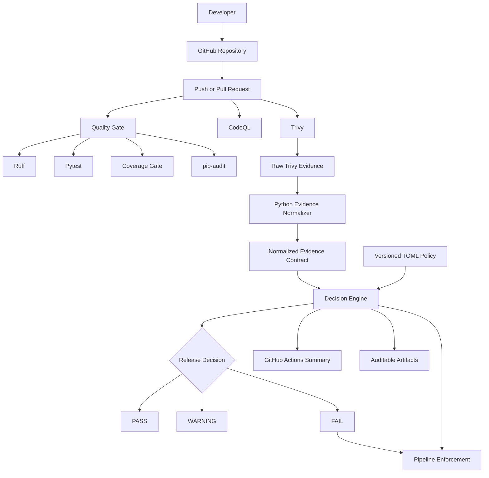

# Solution Architecture

## Purpose

This project implements an automated and auditable release-governance pipeline.

It separates scanner execution, evidence normalization, policy evaluation and release enforcement into independent architectural components.

## Architecture



## Architectural Layers

### 1. CI/CD orchestration

GitHub Actions coordinates all quality, security, evidence and enforcement activities.

### 2. Technical controls

The current implementation executes:

| Control | Technology | Purpose |
|---|---|---|
| Code quality | Ruff | Detect code-quality and maintainability issues |
| Formatting | Ruff | Enforce consistent source formatting |
| Unit testing | pytest | Validate functional behavior |
| Coverage | pytest-cov | Enforce a minimum test-coverage threshold |
| Dependency security | pip-audit | Detect known vulnerable Python dependencies |
| Static security analysis | CodeQL | Analyze application code and workflow definitions |
| Repository security | Trivy | Scan vulnerabilities, secrets and misconfigurations |

### 3. Evidence normalization

The Trivy normalizer converts scanner-specific JSON into a smaller, stable evidence contract.

This reduces coupling between the governance decision and the scanner's native output format.

### 4. Policy as configuration

Release requirements are stored in a version-controlled TOML policy.

The policy currently defines:

- Valid evidence is mandatory.
- Critical vulnerabilities are not allowed.
- High vulnerabilities are not allowed.
- Medium vulnerabilities generate a warning.

### 5. Decision engine

The Python decision engine evaluates normalized evidence against the selected policy.

It produces:

| Decision | Meaning |
|---|---|
| `PASS` | All blocking controls are satisfied |
| `WARNING` | Blocking controls pass, but non-blocking findings require attention |
| `FAIL` | At least one blocking control is not satisfied |

### 6. Enforcement

A `FAIL` decision returns a non-zero execution code and blocks the workflow.

Missing decision evidence also blocks the workflow, implementing fail-closed behavior.

## Evidence Model

Each Trivy execution preserves three levels of evidence:

```text
trivy-results.json
        ↓
Scanner-native raw evidence

trivy-summary.json
        ↓
Normalized vendor-neutral evidence

release-decision.json
        ↓
Policy evaluation and release decision
```

The GitHub Actions run preserves these files as downloadable artifacts.

## Key Design Decisions

### Separation of responsibilities

Scanners identify technical findings. They do not make the final organizational release decision.

### Vendor-neutral governance contract

The decision engine consumes normalized evidence rather than depending directly on Trivy's complete schema.

### Version-controlled policy

Control thresholds are maintained outside the decision-engine implementation.

### Fail-closed behavior

Invalid or missing mandatory evidence cannot generate a successful release decision.

### Explainability

Every blocking finding includes:

- A control identifier.
- A human-readable explanation.
- The observed value.
- The expected policy threshold.

### Auditability

The evidence retains repository, branch, commit, scanner version, report identifier and policy version.

## Security Boundaries

This POC does not treat generated evidence as inherently trustworthy.

A production implementation would additionally require:

- Signed evidence.
- Protected branches.
- Restricted workflow modification.
- Artifact attestations.
- Environment approvals.
- Separation of policy-author and code-author permissions.
- Central retention and immutable audit storage.

## Future Evolution

Potential future increments include:

- Multiple scanner adapters.
- JSON Schema validation.
- Open Policy Agent and Rego.
- Time-limited risk exceptions.
- `PASS WITH EXCEPTION`.
- Container-image scanning.
- Software bill of materials generation.
- Artifact attestations.
- Deployment-environment approvals.